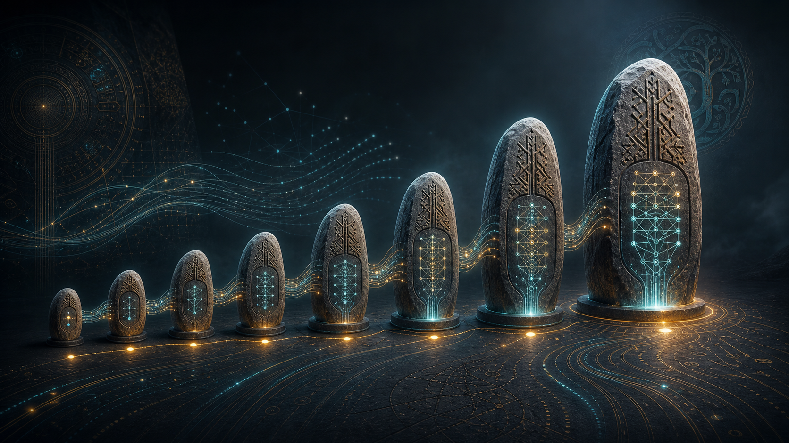

# Orkhon Soyağacı

[English](lineage.md) | [Türkçe](lineage.tr.md)



> Her Orkhon modeli Türk tarihinden bir figür, yer veya kavramla adlandırılır. Sırayla okunduğunda isimler tek
> bir hikaye anlatır: Orhun Yazıtları'ndan, yani bilinen en eski Türkçe yazılı metinlerden, dil yazabilen bir
> sisteme.

## Hat

> Hikaye **kurucularla** (`bumin`, `istemi`) başlar; **danışmanlar ve prensler** (`tonyukuk`, `kultigin`,
> `bilge`) üzerinden ilerler; **dil ve yazıt işine** (`kashgari`, `bengü`, `bengü-göktürk`) dallanır; **gök ve
> yurt** (`tengri`, `ötüken`) basamağına çıkar; **bilgeliğe** (`kutadgu`) ulaşır; sonra **destan ataları ve
> cihan fatihleri** (`oğuz`, `manas`, `tarkan`, `ergenekon`, `atilla`, `timur`) boyunca yükselir ve en sonda
> Orkhon'un olabilecek en büyük, en bilge modeli olan `korkut`ta, ölümsüz ozan-bilgede tamamlanır.

Aynı elle yazılmış Orkhon kodu merdivenin her basamağında durur. Mimari büyürken değişmez; yalnızca iki sayı
değişir: modelde kaç parametre olduğu ve eğitimde kaç token okuduğu.

## İki sayı, asla karıştırılmaz

- **Parametre** = modelin boyutu. Disk boyutunu belirler: `disk ≈ params × bytes-per-weight` (fp32'de 4 byte,
  bf16'da 2, int4 quantized yaklaşık 0.5).
- **Token** = eğitimde okunan metin miktarı. Modelin *kabiliyetini* belirler, büyüklüğünü değil.

Roadmap'i taşıyan kural: kullanmayı düşündüğünüz bir model için **parametre sayısının yaklaşık 100-200 katı
token** okutun. 50M model yaklaşık 10B token, 1B model yaklaşık 200B token ister. Daha uzun eğitim modeli
daha *yetenekli* yapar; daha *büyük* yapmaz.

---

## Şimdiye kadar eğitilen ve arşivlenen modeller

Her model `models/<name>-<date>/` içinde weights, tokenizer, sample output, eval metrics, üretimi yapan kod
snapshot'ı ve `run.sh` ile yaşar. Aşağıdaki model zoo bunun kısa görünümüdür.

| İsim | Parametre | Eğitim verisi | Nedir | Kaynak isim |
|------|-----------|---------------|-------|-------------|
| **bumin** | 4M | sentetik aritmetik | `What is 2 plus 2? → Answer: 4.` cevabı veren ilk chat modeli | **Bumin Kağan** — Birinci Göktürk Kağanlığı'nın kurucusu |
| **tonyukuk** | 22M | TinyStories (47M tok) | akıcı, tutarlı kısa hikayeler yazar | **Tonyukuk** — Orhun dönemi bilge devlet adamı |
| **kultigin** | 22M | story instructions | komut alıp hikaye yazar | **Kül Tigin** — Orhun yazıtlarında anılan Göktürk prensi |
| **istemi** | 51M | FineWeb-Edu gerçek web metni | gerçek web metni üzerindeki ilk Orkhon base'i | **İstemi Kağan** — devleti batıya taşıyan kurucu |
| **kashgari** | 135M | import edilmiş SmolLM2 | Orkhon Transformer'ına exact logit parity ile yüklenen açık base | **Mahmud el-Kaşgari** — Türk dillerinin ilk büyük sözlüğü |
| **bengü** | 57M | EN/TR bilingual text | Türkçe fertility'si daha iyi Türkçe-capable base | ***Bengü Taş*** — ebedi yazıt taşları |
| **bengü-göktürk** | 57M | deterministik rune→Latin SFT | Eski Türkçe script transliteratörü; çevirmen değil | **Göktürk / Orhun script'i** |

*Metrikler:* bumin ppl 5.1 · tonyukuk ppl 4.8 · istemi ppl 46.5 · bengü ppl 47.1.
Küçük benchmark JSON raporları [`reports/`](../reports/README.tr.md) altında.

---

## Tırmanış — laptop'tan ucuz cloud'a

Sıradaki modeller aynı mimariyle, daha fazla parametre ve çok daha fazla token ile büyür. İlk iki basamak laptop
üzerinde mümkündür; geri kalanı spot GPU ister. Maliyetler planlama tahminidir; her ücretli run öncesi GPU
fiyatlarını yeniden kontrol edin.

| İsim | Parametre | Token | Disk (fp32) | Donanım | Maliyet | Sıçrama | Kaynak isim |
|------|-----------|-------|-------------|---------|---------|---------|-------------|
| **istemi-R1** | 50M | 10B | ~200 MB | M5 Pro, ~2 hafta | ücretsiz | arşivli `istemi`den 60× fazla veriyle ilk düzgün 50M run | **İstemi Kağan** |
| **bilge** | 125M | 25B | ~500 MB | 8×H100, ~19s | ~$190 | cloud'da ilk gerçek sinyal | **Bilge Kağan** |
| **tengri** ★ | 350M | 70B | ~1.4 GB | 8×H100, ~5.6g | ~$1.35k | **paylaşmaya değen ilk MVP** | **Tengri** |
| **otuken** ★ | 1B | 200B | ~4 GB | 16×H100, ~18g | ~$17k | gerçekten işe yarar base + instruction-following | **Ötüken** |
| **balasagun** | 3B | 600B | ~12 GB | 32×GPU, ~36g | ~$83k | fonlu stretch | **Balasagun** |
| **kutadgu** | 7B | 1.3T | ~28 GB | 64×H100, ~68g | ~$315k+ | OLMo-3-7B bandı | ***Kutadgu Bilig*** |

★ = önerilen durma noktası. Solo builder için **tengri (350M)** adınızı koymaya değen modeldir. Fonlu ekip için
**otuken (1B)** tatlı noktadır.

---

## Frontier — lab ve egemen ölçek

7B sonrasında fiilen frontier lab ölçeğine girilir: binlerce GPU, aylar, milyonlarca dolar. Kod yolu ~70B'ye
kadar aynı kalabilir; üstünde Mixture-of-Experts, FP8 ve büyük cluster gerekir. Bu basamaklar aspirational'dır.

| İsim | Parametre | Token | Compute | Spot maliyet | Disk (bf16) | Kaynak isim |
|------|-----------|-------|---------|--------------|-------------|-------------|
| **oguz** | 13B | 2.6T | 0.14M H100-hr | ~$0.3M | 26 GB | **Oğuz Kağan** |
| **manas** | 32B | 6.4T | 0.85M H100-hr | ~$2M | 64 GB | **Manas Destanı** kahramanı |
| **tarkan** | 70B | 14T | 4.1M H100-hr | ~$8M | 140 GB | **Tarkan** |
| **ergenekon** | 130B | 15T | 8.1M H100-hr | ~$16M | 260 GB | **Ergenekon** |
| **atilla** | 180B | 15T | 11.3M H100-hr | ~$22M | 360 GB | **Attila** |
| **timur** | 405B | 16T | 27M H100-hr | ~$54M | 810 GB | **Timur** |
| **korkut** | ~1T (MoE) | 15T+ | 62M H100-hr | ~$125M+ | 2 TB | **Dede Korkut** |

`korkut` Mixture-of-Experts olmak zorundadır; dense trilyon-parametre ağ frontier lab'lar için bile pratik
değildir. Orkhon'un bilgeliğinin (`bilge` → `kutadgu` → `korkut`) sınırıdır.

---

## Nerede ne çalışır

Bu projeyi kuran **Apple M5 Pro (48 GB, MPS)** üzerinde:

| Model | Laptop hükmü |
|-------|--------------|
| **istemi-R1 (50M / 10B)** kadar | ✅ ~2 hafta, ücretsiz; scale-readiness gate'lerinden sonra mümkün |
| **bilge (125M)** | 😬 tam bütçede ~3 ay |
| **tengri (350M)** | 😬 pratik tavan |
| **otuken (1B)** ve üstü | ❌ yıllar; 3B+ 48 GB belleğe sığmaz |

Sebep kod değil fiziktir: eğitim maliyeti yaklaşık `6 × params × tokens` FLOPs. Laptop'un işi veri hattını,
eval harness'ını ve fine-tuning'i doğrulamaktır; ücretli spot run test edilmiş varsayımlarla başlamalıdır.

---

## Model zoo

Her model [`orkhon register`](../README.tr.md#model-adları-ve-model-zoo) ile tarihli ve kendi kendine yeten
klasöre arşivlenir:

```text
models/<name>-<YYYYMMDD>/
  checkpoint/        weights
  tokenizer/         eğitim tokenizer'ı
  samples.txt        üretilmiş çıktılar
  eval.json          metrikler
  code_snapshot.tgz  üretimi yapan src/ + configs
  model_card.md      manifest.json  run.sh
```

Registry sıradaki kod adını otomatik verir; hikaye, tamamlanan her modelin sıradaki ölçülmüş yere oturmasıyla
ilerler. Tam index [`models/registry.tr.md`](../models/registry.tr.md) içindedir.

## Mühendislik planı

Bu doküman *ne* ve *neden* sorusudur. *Nasıl* kısmı; R0→R6 ölçek merdiveni, somut kod boşlukları, GPU ekonomisi
ve Next/Near/Mid planı [`docs/roadmap.tr.md`](roadmap.tr.md) içinde. Yol kararlarının arkasındaki rehber
[`docs/build-your-own-llm-guide.tr.md`](build-your-own-llm-guide.tr.md).

---

*Bir dilin ilk yazılı sözlerinden, dil yazan bir sisteme. `bumin`den `korkut`a.*
