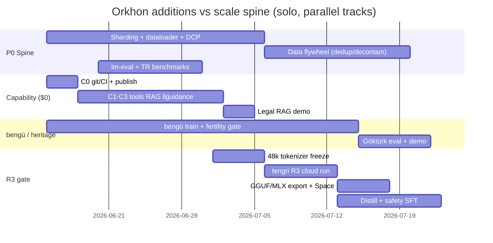

# Orkhon Research Additions (June 2026)

> **Purpose:** Broad parallel research pass for directions **beyond** what is already in
> [`roadmap.md`](roadmap.md) (R0→R6 scale), [`capability-roadmap.md`](capability-roadmap.md) (C0→C8 tools/RAG/agents/vision),
> and [`turkic-languages.md`](turkic-languages.md) (Turkish + Göktürk/`bengü`). Synthesized from 22 independent
> research directions with 2026 grounding. **Audience:** solo builder on Apple Silicon/MPS + occasional cheap cloud GPU.
>
> **Method:** Each direction was explored separately; findings were de-duplicated against existing P0/P1 items and
> capability milestones. Verdicts use **value vs effort** for one person, not a funded lab.

---

## Executive summary

Orkhon's existing docs are unusually complete for a solo project. The scale spine (sharding, DCP, lm-eval, R3 MVP),
capability spine (C0–C5 serve layer, C6–C8 train-time), and Turkic identity (`bengü`, 48k tokenizer freeze, Old Turkic
transliteration) already cover ~80% of what a generic "build your own LLM" roadmap would say.

**What is still missing** falls into three buckets:

1. **Packaging & trust** — export to GGUF/MLX, Turkish eval leaderboard, provenance/watermark hooks, education GTM.
2. **Cheap capability multipliers** — distillation/rejection sampling before GRPO, audio-as-tool, legal RAG vertical,
   AltaySec safety SFT, data flywheel tooling (MinHash, langID, decontam).
3. **Positioning** — not "SmolLM2 but Turkish" (bar moved in 2026) but **auditable Turkic heritage lab** with Göktürk
   as defensible moat.

The highest-ROI additions are almost all **$0 on MPS** or **&lt;$200 cloud** and do not require waiting for R4.

---

## Already documented (do not re-plan; execute)

These are **not** new ideas — they remain the blocking spine. Research only reinforced their priority.

| Item | Where | Why research agrees |
|------|-------|---------------------|
| Sharded tokenize + mixed reader + step-keyed dataloader | `roadmap.md` §2–3, §5 | Every direction (eval, distillation, pan-Turkic, flywheel) assumes this |
| DCP async checkpoints + spot survival | `roadmap.md` §3c | Required before any paid run &gt;2 days |
| `eval/harness.py` + **lm-eval** bridge | `roadmap.md` §3e | Zero benchmarks today = flying blind; kashgari parity is free signal |
| 48k tokenizer freeze (TR + `<\|tool\|>` + `<image>` + rune fertility) | `turkic-languages.md`, `capability-roadmap.md` | One irreversible event before `tengri` (R3) |
| C0–C5 serve layer (tools, RAG, agent loop) | `capability-roadmap.md` | Highest leverage per hour; works on kashgari today |
| `bengü` bilingual track + HPLT/CulturaX mix at R4-ml | `turkic-languages.md`, `roadmap.md` | Turkish is identity, not a side quest |

---

## Direction findings (condensed)

Each row: **what**, **why Orkhon**, **solo effort**, **rough cost**, **depends on**, **concrete assets**, **verdict**.

### 1. Audio / speech (Turkish ASR + TTS, voice assistant)

| Field | Detail |
|-------|--------|
| What | **Audio-as-tool**, not native `orkhon-audio`: mlx-whisper (ASR) + Trendyol-TTS or Piper (TTS) behind C2 executors; optional voice chat demo in Gradio |
| Why Orkhon | Strong Turkish demo without training speech weights; fits "perception → tool first" rule |
| Effort | 3–5 days (MLX wrappers + serve integration) |
| Cost | $0 (MPS); ZeroGPU for public demo |
| Depends on | C1–C2; reliable Turkish answers need R3+ |
| Assets | `mlx-whisper`, Trendyol **TTS** (MLX ports exist in community), `openai/whisper-large-v3-turbo`, Coqui/Piper `tr_TR` voices |
| Verdict | **High value, low effort** — do after C2, before native audio |

### 2. Reasoning & verifiable-reward RL (GRPO / RLVR / R1-style)

| Field | Detail |
|-------|--------|
| What | **Rejection sampling → verifiable rewards** (math `sympy`, code `pytest`, format JSON) before full GRPO; DeepSeek-R1 recipe needs batch generation + reward fns |
| Why Orkhon | C7 in capability roadmap; Orkhon already has DPO — RS is the cheap precursor |
| Effort | RS: 1 week; GRPO: 2–3 weeks + cloud |
| Cost | RS ~$50–150 on spot; GRPO at 1B ~$500–2k |
| Depends on | **R4 (1B)** for GRPO; RS works on kashgari/tengri for pipeline proof |
| Assets | `trl` GRPO patterns, DeepSeek-R1 / Qwen2.5-Math traces (MIT/Apache teachers), `math_verify`, HumanEval/MBPP subsets |
| Verdict | **Defer GRPO to R4**; **do RS + verifiable eval harness now** on laptop |

### 3. Distillation from frontier models

| Field | Detail |
|-------|--------|
| What | Teacher trace collection (Qwen3, DeepSeek-V3 distill variants, SmolLM3) → SFT on reasoning/chat; **not** logits-distill at tiny scale |
| Why Orkhon | Buys Turkish reasoning + tool format before you can RL it yourself |
| Effort | 4–7 days (pipeline + 50k–200k traces) |
| Cost | $0–80 API or self-host teacher on spot |
| Depends on | C6 tool SFT; best on **tengri** (R3) |
| Assets | `HuggingFaceTB/smollm3`, `Qwen/Qwen3-*` (check license), Nemotron-Post-Training-Dataset-v1 slices, OpenThoughts-style math |
| Verdict | **High value at R3** — cheaper than GRPO, pairs with `bengü` |

### 4. Quantization & edge / browser / mobile

| Field | Detail |
|-------|--------|
| What | **Llama-format export → GGUF** (llama.cpp) + **MLX** inference for Apple; **wllama** for browser demo; no custom PyTorch quant kernels |
| Why Orkhon | M5 Pro users and HF consumers expect 4-bit; heritage demo must run offline |
| Effort | 2–3 days export script + parity smoke |
| Cost | $0 |
| Depends on | `export/to_hf.py` parity (exists); R3 weights worth shipping |
| Assets | `llama.cpp` Q4_K_M, `mlx-lm`, `wllama`, `sentencepiece` compat |
| Verdict | **Do at R2/R3** — unlocks edge story without engineering quant in core |

### 5. Pan-Turkic multilingual family model

| Field | Detail |
|-------|--------|
| What | **15% Turkic mix** at R4-ml (already in roadmap) + **TUMLU**-style eval; separate "Altay" branding only after transfer proof |
| Why Orkhon | Thematic fit; HPLT2.0 covers az/kk/uz/ky/ug |
| Effort | Data mixer: 3d; eval: 2d; dedicated 1B run: $3k+ |
| Cost | Mostly tokenize/storage; train = R4-ml budget |
| Depends on | Sharded pipeline + 48k tokenizer; **proof on bengü** before expanding |
| Assets | `HPLT/HPLT2.0`, `facebook/catalan...` → use **CulturaX**, **TUMLU** benchmark, **TurkBench** |
| Verdict | **Stay Turkish-first**; pan-Turkic at 5–10% mix until TUMLU transfer &gt; monolingual TR |

### 6. Safety / alignment (Turkish jailbreaks)

| Field | Detail |
|-------|--------|
| What | Safety SFT from Turkish red-team sets + refusals; lightweight policy tests in eval |
| Why Orkhon | Turkish safety data is underserved; government/edu buyers care |
| Effort | 3–5 days |
| Cost | $0–50 |
| Depends on | SFT pipeline (exists); blocking for public Spaces |
| Assets | **AltaySec** (2025–2026 TR red-team), `allenai/wildguardmix`, translated ShareGPT refusals, **TURKISH_SAFETY** community sets |
| Verdict | **High ROI before any public demo** |

### 7. Evaluation & public leaderboard

| Field | Detail |
|-------|--------|
| What | `lm-eval` tasks: TR-MMLU, TurkBench, TUMLU-mini, HellaSwag, IFEval; **Orkhon Leaderboard** HF Space (static tables + CI) |
| Why Orkhon | Credibility; contamination story for FineWeb-era models |
| Effort | 5–7 days harness + 2d Space |
| Cost | $0 eval on MPS for &lt;350M; cloud for 1B |
| Depends on | P0 harness; publish path C0.1 |
| Assets | `eleutherai/lm-evaluation-harness`, `TurkBench`, `TR-MMLU`, `openai/grade-school-math` for reasoning |
| Verdict | **P0 extension** — not optional for R3 gate |

### 8. Code / math specialist + Turkish coding assistant

| Field | Detail |
|-------|--------|
| What | 10–15% code in R3 mix (roadmap); **Turkish system prompts** + Stack-v2; MBPP/HumanEval-tr reporting |
| Why Orkhon | Devs want TR explanations; code raises MMLU-proxy |
| Effort | Data: in roadmap; TR wrapper: 1d |
| Cost | In R3 token budget |
| Depends on | R3 mix; C1 calculator/RAG tools; code execution stays deferred until container isolation exists |
| Assets | `bigcode/the-stack-v2-dedup`, `MBPP`, `HumanEval`, `microsoft/orca-math` |
| Verdict | **In roadmap** — add **TR instruction templates** and **Turkish code eval** as explicit deliverable |

### 9. Embeddings & retrieval

| Field | Detail |
|-------|--------|
| What | **Reuse** BGE-M3 / e5 / **embeddinggemma**; optional later: small TR adapter via Matryoshka; **do not** train 350M embed model from scratch |
| Why Orkhon | C3 RAG is highest ROI capability |
| Effort | 0 (reuse) + 7d RAG per capability roadmap |
| Cost | $0 |
| Depends on | C3 |
| Assets | `BAAI/bge-m3`, `intfloat/multilingual-e5-large`, `Mursit-TR` (community TR embed), `google/embeddinggemma-300m` |
| Verdict | **Reuse only** — training embeddings is out of scope for solo |

### 10. Long context, memory, personalization

| Field | Detail |
|-------|--------|
| What | YaRN/NTK in RoPE for 8k→32k **after** R3; paged KV + chunked prefill at serve; **user memory** = RAG over chat exports, not weight training |
| Why Orkhon | Roadmap defers to L4; 128k is serve/export problem for small models |
| Effort | YaRN: 3–5d; memory: 2d (file-backed RAG) |
| Cost | $0 |
| Depends on | R3 stable base; export to vLLM for 128k serve |
| Assets | YaRN paper impls in `rope.py`, MemGPT-style patterns in C5 |
| Verdict | **Nice at R3+** — memory-via-RAG now |

### 11. MoE & inference efficiency

| Field | Detail |
|-------|--------|
| What | FlashAttention-2 (if CUDA), speculative decoding (draft model), vLLM for **serving imported** checkpoints |
| Why Orkhon | Training core should stay simple; MoE is roadmap Tier 3 defer |
| Effort | Spec decode: 1w; MoE: months |
| Cost | GPU for FA kernels |
| Depends on | R4 for spec draft model |
| Assets | `vllm`, `flash-attn`, Eagle-style draft |
| Verdict | **Serve-only optimizations**; **skip MoE** until dense R4 works |

### 12. Product / UX (chat UI, API, HF Space)

| Field | Detail |
|-------|--------|
| What | Gradio chat + tools demo, OpenAPI SDK snippet, `orkhon playground` static page; education-focused UX |
| Why Orkhon | Models without UI don't spread; SmolLM3 sets UX bar |
| Effort | 3–5d |
| Cost | $0 (ZeroGPU) |
| Depends on | C0.1 publish, C0.3 Spaces |
| Assets | HF Spaces templates, `gradio`, existing `orkhon serve` |
| Verdict | **Ship with R3** — demo is marketing |

### 13. Open-source, community, grants, paper

| Field | Detail |
|-------|--------|
| What | Public git + CI (C0), model cards with contamination section, short **arXiv** TR/systems paper at R3, HF **Community Compute** grant, courseware as GTM |
| Why Orkhon | Sovereignty narrative (T3-AI discourse 2026) + auditable stack is the differentiator |
| Effort | CI: 0.5d; paper: 2w calendar; grant app: 1d |
| Cost | $0 |
| Depends on | R3 checkpoint + eval table |
| Assets | HF Open Source AI Grant, ST Education, `orkhon` course from `build-your-own-llm-guide.md` |
| Verdict | **Education + heritage paper** beats generic "we trained a 350M" |

### 14. Cultural-heritage NLP (Old Turkic, Ottoman, epics)

| Field | Detail |
|-------|--------|
| What | **Göktürk transliteration** (in `turkic-languages.md` + `data/old_turkic/`); **synthetic runiform OCR** (ViT, small); Ottoman Arabic-script = institutional/OCR project — **don't** own full pipeline |
| Why Orkhon | Defensible moat; no competitor optimizes rune fertility |
| Effort | Transliteration SFT: in bengü plan; OCR prototype: 1–2w |
| Cost | $0–100 synthetic data gen |
| Depends on | 48k tokenizer freeze; bengü |
| Assets | Uppsala runiform DB (CC BY-NC-SA), Orkhon inscription texts, `data/old_turkic/` |
| Verdict | **Double down on Göktürk**; Ottoman = cite-only/partner |

### 15. Data flywheel (synthetic, dedup, decontam)

| Field | Detail |
|-------|--------|
| What | **datasketch** MinHash dedup, **datatrove** filters, fastText langID, 13-gram benchmark decontam; synthetic via teacher **post-train** not Nemotron-scale pretrain |
| Why Orkhon | Roadmap lists gaps; flywheel makes each run cheaper |
| Effort | 1–2w for curation layer |
| Cost | $0 CPU; storage ~$20/mo at R3 scale |
| Depends on | P0 sharding |
| Assets | `datatrove`, `datasketch`, `fasttext` lid.176.bin, `vngrs/TurkishWebCorpus` over raw FineWeb-2-tr |
| Verdict | **P0 extension** — same priority as sharding |

### 16. Domain verticals (legal, medical, edu, gov)

| Field | Detail |
|-------|--------|
| What | **Legal RAG** first (structured corpus); medical CPT needs licensed data — skip; **edu** = courseware + exam QA; gov = safety + citation |
| Why Orkhon | Turkish legal tech is active; RAG avoids domain CPT |
| Effort | Legal ingest: 3d; edu content: ongoing |
| Cost | $0 |
| Depends on | C3 RAG |
| Assets | `erdem-erdem` Turkish legal corpus (community), Mevzuat scrapes (check license), ÖSYM-style QA synthetic |
| Verdict | **Legal RAG demo** = best vertical story |

### 17. Structured output / grammar decoding

| Field | Detail |
|-------|--------|
| What | **llguidance** or `outlines` for JSON/tool-call constraints at serve time |
| Why Orkhon | Improves C1 tool reliability without training |
| Effort | 1–2d |
| Cost | $0 |
| Depends on | C1 |
| Assets | `llguidance`, `outlines`, `xgrammar` |
| Verdict | **Quick win with C1** |

### 18. Model merging (TIES / DARE)

| Field | Detail |
|-------|--------|
| What | Merge specialists (code, TR, tools) on **same-arch** `tengri` checkpoints post-R3 |
| Why Orkhon | Cheap ensemble without multi-run pretrain |
| Effort | 2–3d |
| Cost | $0 |
| Depends on | R3 multiple SFT heads |
| Assets | `mergekit`, TIES/DARE papers |
| Verdict | **After R3** — do **not** merge bengü (34M) with kashgari (arch mismatch) |

### 19. MLX training adjunct

| Field | Detail |
|-------|--------|
| What | **MLX-LM** for LoRA/SFT on imported bases on M5; **not** canonical pretrain port |
| Why Orkhon | Fast iteration on Apple Silicon |
| Effort | 2d |
| Cost | $0 |
| Depends on | HF export |
| Assets | `mlx-lm` |
| Verdict | **Inference + LoRA only**

### 20. Watermarking & provenance

| Field | Detail |
|-------|--------|
| What | Optional **KGW** watermark at serve; `X-Orkhon-Model` + dataset provenance headers; CodeCarbon logs |
| Why Orkhon | EU AI Act Art. 50 disclosure; research credibility |
| Effort | 2–3d |
| Cost | $0 |
| Depends on | Serve API |
| Assets | `markllm`, CodeCarbon |
| Verdict | **Nice before public API** |

### 21. Teaching / courseware GTM

| Field | Detail |
|-------|--------|
| What | "Build Your Own LLM" course using Orkhon repo; workshop series; Bilge Kağan narrative |
| Why Orkhon | Solo builder can't out-train Kumru-2B; **can** own education + transparency |
| Effort | 1–2w initial course outline + videos |
| Cost | $0 |
| Depends on | C0 public repo |
| Assets | Existing `build-your-own-llm-guide.md` |
| Verdict | **Primary GTM** alongside heritage |

### 22. Gaps the roadmaps under-specify

| Gap | Recommendation |
|-----|----------------|
| No `.git` / public CI | C0 — do immediately |
| Contamination reporting | Add FineWeb + benchmark 13-gram overlap to model card template |
| Competitive framing | Position vs SmolLM3/OLMo3/Qwen3 as **heritage + auditability**, not raw bench |
| Nemotron-scale synthetic pretrain | **Don't** — use teacher traces for SFT only |
| Native `orkhon-vl` / `orkhon-audio` | C8 / post-R4; tools-first until R3 proves dense base |
| Beating Turkish closed models | **Out of scope** — partner or specialize (legal/Göktürk) |

---

## Prioritized "what to add"

### Tier A — Top 7 (highest value; do these)

| # | Addition | Effort | Cost | Rung / cap | One-line why |
|---|----------|--------|------|------------|--------------|
| **A1** | **Data flywheel layer** (MinHash dedup, fastText langID, 13-gram decontam, datatrove quality) | 1–2w | ~$20 storage | P0 / R2+ | Unlocks honest scaling and eval |
| **A2** | **lm-eval harness + Turkish task suite + public leaderboard** | 1w | $0 | P0 / C-EVAL | Turns perplexity into credibility |
| **A3** | **C1–C3 serve layer on kashgari** + **llguidance** structured output | ~2w | $0 | C1–C3 now | Best capability/$; works today |
| **A4** | **GGUF + MLX + wllama export path** | 2–3d | $0 | R2 export | Edge + browser demos without quant R&D |
| **A5** | **AltaySec safety SFT + eval gate** | 3–5d | &lt;$50 | Pre-Spaces | Required for any public Turkish demo |
| **A6** | **Distillation / rejection-sampling pipeline** (teacher traces → SFT) | 1w | &lt;$100 | C6 / R3 | Reasoning + tools without GRPO cost |
| **A7** | **Heritage GTM package** — Göktürk demo + courseware + short systems paper | 2–3w cal | $0 | `bengü` + R3 | Moat vs generic small LMs |

**Honorable mention (A8):** **Legal RAG vertical demo** (`erdem-erdem` ingest) — 3 days once C3 exists; best "show don't tell" for Turkish market.

### Tier B — Nice later (worth doing; not blocking)

| Addition | When | Notes |
|----------|------|-------|
| Audio-as-tool (mlx-whisper + TR TTS) | After C2 | Great demo; not core |
| Memory via RAG (chat history ingest) | With C3 | Cheaper than long-context training |
| YaRN / 8k context extension | R3 `tengri` | Before marketing "long context" |
| Speculative decoding + vLLM serve | R4 export | Serve path only |
| TIES merge of R3 specialists | Post-R3 | Same-arch only |
| KGW watermark + provenance API headers | Pre-API launch | Compliance |
| Synthetic runiform OCR prototype | Parallel to bengü | Research halo |
| HF Community Compute grant application | Before R3 cloud run | Offsets ~$1k |
| Pan-Turkic 10–15% mix + TUMLU eval | R4-ml | After bengü proves TR transfer |
| Math/code RS with verifiable rewards | R3–R4 | Precursor to GRPO |
| Gradio playground + ZeroGPU Space | R3 checkpoint | Pairs with A5 safety |

### Tier C — Don't bother / out of scope (2026 honest)

| Item | Why skip |
|------|----------|
| **Native `orkhon-audio` / `orkhon-vl` training** | Tools + C8 gating; months of GPU; Qwen3-VL/SmolVLM win on quality |
| **MoE architecture** | Roadmap Tier 3 defer; destabilizes solo stack |
| **R5/R6 (3B–7B) without funding** | $80k–600k; guide says fine-tune open weights for product |
| **Train Turkish embedding model from scratch** | BGE-M3/Mursit sufficient |
| **Custom PyTorch quantization kernels** | llama.cpp/MLX solved this |
| **Full GRPO at R3 (350M)** | Too weak to reward; RS + SFT first |
| **Nemotron-CC-scale synthetic pretrain** | Cost and contamination risk |
| **Ottoman Arabic-script OCR pipeline** | Institutional; not solo |
| **Medical domain CPT** | License wall |
| **Beat Kumru-2B / TURNA on general TR** | Wrong fight for solo builder |
| **ExecuTorch / mobile C++ port** | MLX + GGUF enough for Apple |
| **vLLM-native architecture in training core** | Export and serve separately |
| **15-language pan-Turkic model brand** | Before TUMLU transfer proof on bengü |
| **Merge bengü into kashgari** | Vocab/arch mismatch |

---

## Suggested sequencing (next 90 days)

**Parallelism rule:** Capability track (C0–C3) and P0 spine are **independent** until R3 tokenizer freeze — run both on the M5 while `bengü` trains.

---

## Competitive positioning (2026)

| They | Orkhon response |
|------|-----------------|
| SmolLM3, OLMo3, Qwen3 (open weights) | Don't compete on general 1B benches |
| Kumru-2B, TURNA, Trendyol LLM | Don't compete on Turkish fluency at scale |
| Closed TR APIs | Win on **auditability**, **Göktürk**, **legal/RAG demo**, **education** |
| "Sovereign AI" discourse (TR/EU) | Open stack + provenance + local MLX = credible sovereignty story |

**One sentence pitch:** *Orkhon is the auditable, from-scratch Turkic language lab — from Göktürk runes to modern Turkish — that you can train, evaluate, and serve yourself.*

---

## Appendix: concrete dataset & tool index

| Need | Names (2026) |
|------|----------------|
| Turkish web (curated) | `HPLT/HPLT2.0`, `uonlp/CulturaX`, `vngrs/TurkishWebCorpus` |
| Turkish eval | **TurkBench**, **TR-MMLU**, **TUMLU**, AltaySec safety |
| English / multilingual eval | `lm-eval`: HellaSwag, ARC, MMLU, IFEval, GSM8K |
| Code | `bigcode/the-stack-v2-dedup`, HumanEval, MBPP |
| Math reasoning | `microsoft/orca-math`, GSM8K, teacher traces from Qwen2.5-Math |
| Legal TR | `erdem-erdem` corpus (community) |
| Old Turkic | Uppsala runiform DB, `data/old_turkic/` |
| Dedup / clean | `datatrove`, `datasketch` MinHash |
| Embeddings | `BAAI/bge-m3`, `intfloat/multilingual-e5-large`, `google/embeddinggemma-300m` |
| Teachers (distill) | SmolLM3, Qwen3 (verify license), DeepSeek-R1-Distill |
| ASR / TTS tools | mlx-whisper, Trendyol TTS MLX, Piper `tr_TR` |
| Edge serve | llama.cpp GGUF, `mlx-lm`, wllama |
| Structured decode | `llguidance`, `outlines` |
| Safety | AltaySec, WildGuardMix |
| Grants | Hugging Face Community Compute, ST Education |

---

## Document metadata

- **Research threads:** 22 parallel directions (audio, RLVR, distill, quant, pan-Turkic, safety, eval, code/math, embeddings, long-context, MoE, product, OSS, heritage, flywheel, verticals, structured output, gaps, merging, MLX, watermark, education).
- **De-duplication source:** `roadmap.md`, `capability-roadmap.md`, `turkic-languages.md`, `lineage.md`, live `src/orkhon/` tree.
- **Next action:** Fold A1–A7 into `implementation-plan.md` Phase labels; do **not** fork a third roadmap — extend P1/C-EVAL with the Tier A rows above.
